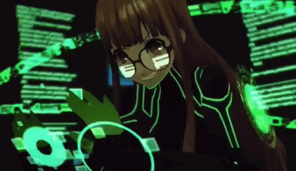
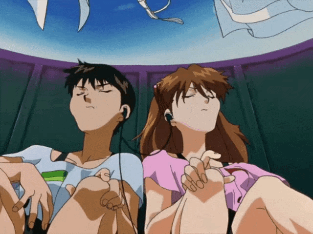

### Olá! Eu sou o Marcelo, também conhecido como Miraizito! 🔥

Faço umas besteiras por aí 😅  
Gosto de tecnologia, animes, jogos, leituras e afins. 🎮📚✨

### Contato 💬

Meu Discord: **miraizito7810**

### Minhas redes e perfis 🎮

### Linguagens de programação 💻

### Proporção de linguagens nos meus projetos 📊

### Estatísticas do GitHub 📈

### Meus GIFs ✨

#### Games 🎮

#### Animes 📺

#### Tecnologia 🤖

#### Estudos 📚

#### Música 🎵

